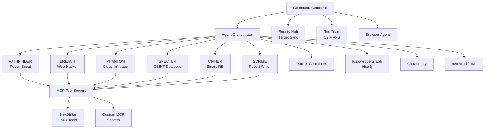
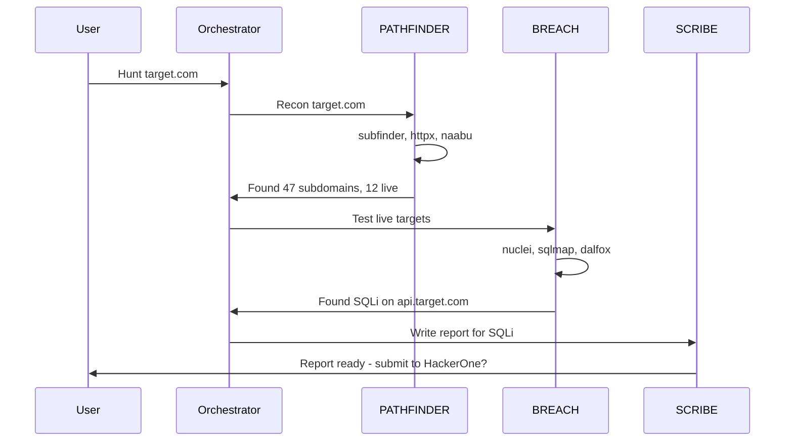

```
 _   _                      _           _             
| | | | __ _ _ __ _ __ ___ (_)_ __   __| | ___ _ __ 
| |_| |/ _` | '__| '_ ` _ \| | '_ \ / _` |/ _ \ '__|
|  _  | (_| | |  | | | | | | | | | | (_| |  __/ |   
|_| |_|\__,_|_|  |_| |_| |_|_|_| |_|\__,_|\___|_|   
```

Autonomous Offensive Security Framework — Local-First, MCP-Powered, Swarm Intelligence

[](https://opensource.org/licenses/MIT)
[](https://github.com/Haribinger/Harbinger/releases)
[](https://github.com/Haribinger/Harbinger/stargazers)
[](https://hub.docker.com/r/haribinger/harbinger)
[](https://github.com/Haribinger/Harbinger/actions/workflows/ci.yml)

## 🌟 Overview

Harbinger is an advanced, autonomous offensive security framework designed for comprehensive vulnerability discovery and management. Leveraging a local-first approach and powered by the Model Context Protocol (MCP), Harbinger orchestrates a swarm of specialized agents to mimic real-world adversary tactics, providing unparalleled depth in security assessments.

## 🧠 Architecture



## 🚀 Data Flow Example



## ✨ Features

- 🤖 **Autonomous Agent Swarm**: Intelligent, self-orchestrating agents for comprehensive security assessments.
- 🌐 **Local-First Design**: Ensures data privacy and operational control, with optional cloud integration.
- 🔌 **MCP-Powered Tooling**: Seamless integration with 150+ security tools via Model Context Protocol.
- 🧠 **Swarm Intelligence**: Agents collaborate and adapt, sharing insights through a central Knowledge Graph.
- 📊 **Real-time Visualization**: Interactive dashboards and attack graphs for live operational oversight.
- 🚀 **Rapid Deployment**: Docker-based setup for quick and consistent environment provisioning.
- 🛡️ **Red Team Capabilities**: Integrated C2, VPS management, and advanced adversary emulation.
- 🔄 **Automated Workflows**: n8n integration for customizable security automation playbooks.
- 📝 **Automated Reporting**: SCRIBE agent generates platform-specific, high-quality vulnerability reports.

## ⚡ Quick Start

Get Harbinger up and running in three simple commands:

```bash
gh repo clone Haribinger/Harbinger harbinger-big && cd harbinger-big
./install.sh # (Hypothetical installer script)
docker compose up -d
```

## 📁 Project Structure

```
harbinger-big/
├── .github/
│   └── workflows/
│       ├── ci.yml
│       └── auto-changelog.yml
├── agents/
│   ├── breach/
│   │   └── SYSTEM_PROMPT.md
│   ├── cipher/
│   │   └── SYSTEM_PROMPT.md
│   ├── phantom/
│   │   └── SYSTEM_PROMPT.md
│   ├── pathfinder/
│   │   └── SYSTEM_PROMPT.md
│   ├── scribe/
│   │   └── SYSTEM_PROMPT.md
│   └── specter/
│       └── SYSTEM_PROMPT.md
├── docs/
│   ├── TOOL_INTEGRATIONS.md
│   ├── getting-started.md
│   ├── api-reference.md
│   ├── plugin-development.md
│   ├── deployment-guide.md
│   └── troubleshooting.md
├── skills/
│   └── scripts/
│       ├── recon-full.sh
│       ├── web-scan.sh
│       ├── cloud-audit.sh
│       ├── osint-person.sh
│       └── generate-report.sh
├── CHANGELOG.md
├── README.md
├── backend/
├── frontend/
└── install.sh # (Hypothetical installer script)
```

## 🤖 Agent Roster

| Agent Name | Role | Core Directive | Key Tools/Focus |
|:-----------|:-----|:---------------|:----------------|
| **PATHFINDER** | Recon Scout | Map the entire attack surface. | subfinder, httpx, naabu, dnsx, nuclei (info) |
| **BREACH** | Web Hacker | Exploit web vulnerabilities. | nuclei, sqlmap, dalfox, burpsuite, OWASP ZAP |
| **PHANTOM** | Cloud Infiltrator | Identify and exploit cloud misconfigurations. | Cloud-specific enumeration tools, IAM assessment |
| **SPECTER** | OSINT Detective | Gather and analyze open-source intelligence. | Social media analysis, email patterns, breach data |
| **CIPHER** | Binary RE | Reverse engineer binaries and firmware. | Disassemblers, debuggers, vulnerability analysis tools |
| **SCRIBE** | Report Writer | Generate clear, actionable vulnerability reports. | Markdown, platform-specific templates, CVSS scoring |

## 🛠️ Tech Stack

| Category | Technology | Description |
|:---------|:-----------|:------------|
| **Backend** | Go, Gin | High-performance API and agent orchestration. |
| **Frontend** | React, TypeScript, Vite | Modern, responsive Command Center UI. |
| **Database** | PostgreSQL, Neo4j, Redis | Primary data store, knowledge graph, caching. |
| **Containerization** | Docker, Docker Compose | Isolated environments for agents and services. |
| **Automation** | n8n | Workflow automation and integration. |
| **Security Tools** | HexStrike, ProjectDiscovery | 150+ integrated offensive security tools. |
| **AI/ML** | OpenAI, Anthropic, Google AI | AI-powered analysis and decision-making. |

## 🆚 Harbinger vs. Competitors

| Feature | Harbinger | Traditional Scanners | Manual Pentesting | Other AI Platforms |
|:--------|:---------|:---------------------|:------------------|:------------------|
| **Autonomy** | High (Swarm Intelligence) | Low (Scripted) | Low (Human-driven) | Medium (Single Agent) |
| **Tool Integration** | 150+ (MCP-Powered) | Limited (Built-in) | Manual (Human-selected) | Moderate (API-based) |
| **Contextual Awareness** | High (Knowledge Graph) | Low | High | Medium |
| **Report Generation** | Automated, Platform-specific | Basic | Manual | Basic |
| **Red Team Ops** | Integrated C2, VPS | None | High | Limited |
| **Cost Efficiency** | High | Medium | Low | Medium |

## 🤝 Contributing

We welcome contributions from the community! Whether it's bug reports, feature requests, or code contributions, your input helps make Harbinger better. Please see our [Contributing Guide](CONTRIBUTING.md) for details on how to get involved.

## 📄 License

Harbinger is open-source and licensed under the MIT License. See the [LICENSE.md](LICENSE.md) file for more details.

## 📚 Documentation & Support

- [Getting Started Guide](docs/getting-started.md)
- [API Reference](docs/api-reference.md)
- [Plugin Development](docs/plugin-development.md)
- [Deployment Guide](docs/deployment-guide.md)
- [Troubleshooting](docs/troubleshooting.md)
- [Tool Integrations](docs/TOOL_INTEGRATIONS.md)
- [GitHub Issues](https://github.com/Haribinger/Harbinger/issues)
- [Discord Community](https://discord.gg/harbinger) (Hypothetical link)
