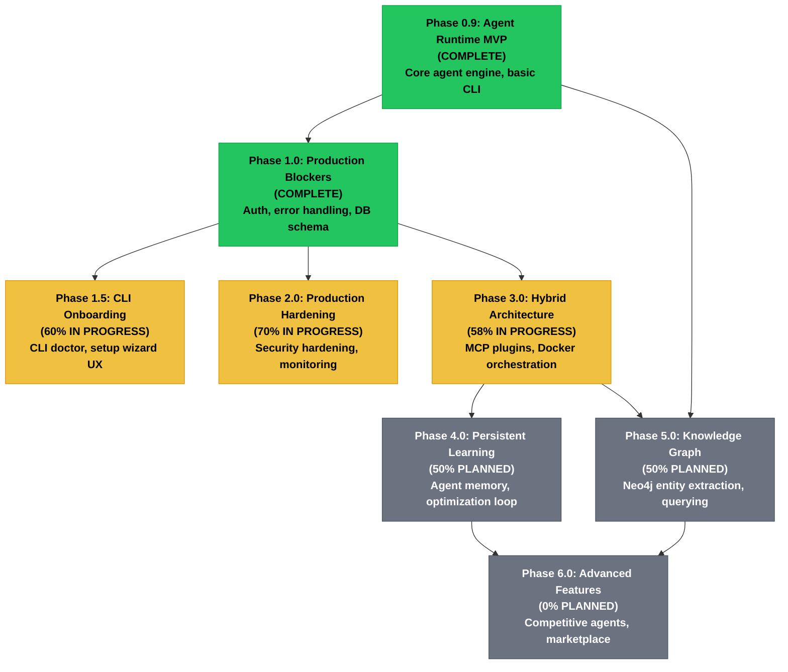

# Harbinger Roadmap & Timeline

Strategic multi-phase development roadmap for the Harbinger autonomous security framework. This document outlines project phases, dependencies, deliverables, and release targets through Q2 2027.

---

## Phase Dependency Graph

Flowchart showing phase dependencies and completion status:



---

## Timeline & Release Targets

Gantt chart showing release schedule and phase timelines:

```mermaid
gantt
    title Harbinger Release Timeline (2026-2027)
    dateFormat YYYY-MM-DD

    section Phases
    Phase 0.9: DONE, p09, 2024-01-01, 365d
    Phase 1.0: DONE, p10, after p09, 180d
    Phase 1.5: ACTIVE, p15, after p10, 150d
    Phase 2.0: ACTIVE, p20, after p10, 200d
    Phase 3.0: ACTIVE, p30, after p10, 300d
    Phase 4.0: CRIT, p40, after p30, 250d
    Phase 5.0: CRIT, p50, after p09 p30, 280d
    Phase 6.0: CRIT, p60, after p40 p50, 200d

    section Releases
    v1.3: v13, after p10, 90d
    v1.4: v14, after v13, 90d
    v1.5: v15, after v14, 90d
    v1.6: v16, after v15, 90d
    v2.0: v20, after v16, 60d
```

---

## Release Roadmap

Strategic version targets and key deliverables:

### v1.3 (Q2 2026)

**Focus:** Chat UX, CLI diagnostics, Workflow improvements

- **Chat Persistence** — Store conversation history, enable resumable agent sessions
- **CLI Doctor** — Automated health checks (dependencies, config, connectivity)
- **WorkflowEditor UX** — Drag-and-drop refinements, visual debugging, template library
- **Agent Memory** — Per-agent context persistence across sessions

**Estimated Completion:** June 2026

---

### v1.4 (Q3 2026)

**Focus:** Production security, plugin ecosystem, channel expansion

- **HTTPS/TLS** — End-to-end encryption, certificate management
- **Channel Registry** — Standardized plugin format for Discord/Telegram/Slack/custom
- **Plugin Loader** — Hot-reload MCP servers, plugin discovery, dependency resolution
- **CodeHealth v2** — AST analysis, metric aggregation, trend visualization
- **Browser Sessions** — CDP session pooling, authentication persistence

**Estimated Completion:** September 2026

---

### v1.5 (Q4 2026)

**Focus:** Developer experience, knowledge integration, memory systems

- **Plugin SDK** — Agent behavior templates, tool wrapper framework, testing harness
- **Persistent Agent Memory** — SQLite per-agent, semantic search via embeddings
- **Neo4j CRUD** — Entity/relationship ingestion from scan results, graph queries
- **Workflow Versioning** — Rollback support, audit trail, collaborative editing
- **API Stability** — OpenAPI 3.0 spec, SDK generation, versioned contracts

**Estimated Completion:** December 2026

---

### v1.6 (Q1 2027)

**Focus:** Intelligence, knowledge synthesis, training data

- **Strategic Memory** — Cross-agent learning, pattern recognition, recommendation engine
- **HowToHunt Ingestion** — Automated hacking methodology indexing, retrieval-augmented attacks
- **Knowledge Graph Visualization** — Interactive entity graphs, attack path discovery
- **Skill Marketplace** — Community-contributed skills, ratings, dependency management
- **Agent Specialization** — Fine-tuned models, role-specific knowledge bases

**Estimated Completion:** March 2027

---

### v2.0 (Q2 2027)

**Focus:** Multi-agent competition, commoditization, ecosystem

- **Competitive Agents** — Agent-vs-agent optimization, leaderboard scoring, tournament mode
- **Skill Marketplace v2** — Monetization, verified publishers, SLA tracking
- **Agent Cloning** — Behavior replication, mutation, evolutionary optimization
- **Horizontal Scaling** — Kubernetes support, distributed agent orchestration
- **Compliance Export** — CVSS scoring, NIST mapping, regulatory reporting templates

**Estimated Completion:** June 2027

---

## Phase Details

### Phase 0.9: Agent Runtime MVP

**Status:** COMPLETE
**Dependencies:** None

Foundational agent engine and minimal CLI for local execution.

#### Deliverables

- Core agent orchestration loop (autonomous-engine.js)
- 6 base agent types (PATHFINDER, BREACH, PHANTOM, SPECTER, CIPHER, SCRIBE)
- Basic skill system (resource library)
- CLI entry point, docker-compose configuration
- MCP protocol v1.0 integration

#### Code Artifacts

- `agents/shared/autonomous-engine.js` — Main agent loop
- `agents/*/SOUL.md` — Agent personality and capabilities
- `backend/cmd/main.go` — Basic routing
- `docker-compose.yml` — Service definitions

---

### Phase 1.0: Production Blockers

**Status:** COMPLETE
**Dependencies:** Phase 0.9

Production-readiness: auth, database, error handling, monitoring.

#### Deliverables

- PostgreSQL integration with pgvector
- OAuth2 (GitHub, Google) authentication
- Error handling and crash resilience
- Request/response validation
- Basic dashboard and metrics
- Docker compose health checks

#### Code Artifacts

- `backend/cmd/database.go` — Schema and CRUD
- `backend/cmd/oauth.go` — OAuth flows
- `harbinger-tools/frontend/pages/Dashboard.tsx` — Main dashboard
- Error boundaries and fallback pages

---

### Phase 1.5: CLI Onboarding

**Status:** 60% IN PROGRESS
**Dependencies:** Phase 1.0

Improve first-run user experience and diagnostics.

#### Deliverables

- `harbinger-cli` diagnostic tool (dependency checks, port availability, secrets validation)
- Interactive setup wizard with validation
- Config file scaffolding and templating
- Agent template marketplace
- Provider health status checks
- Migration guides from v1.0 → v1.3

#### Code Artifacts

- `scripts/doctor.sh` — Diagnostic script
- `harbinger-tools/frontend/pages/SetupWizard.tsx` — Setup flow
- `backend/cmd/main.go` → setup handlers
- Template definitions in `templates/`

---

### Phase 2.0: Production Hardening

**Status:** 70% IN PROGRESS
**Dependencies:** Phase 1.0

Security, monitoring, performance optimization.

#### Deliverables

- Rate limiting and DDoS protection
- Secret management (sealed secrets, key rotation)
- Request signing and HMAC validation
- Comprehensive logging (structured logs, ELK stack ready)
- Performance profiling and optimization
- Backup/restore procedures

#### Code Artifacts

- Middleware in `backend/cmd/main.go`
- Secret store integration (`backend/cmd/main.go` → secretsManager)
- Logging standardization across handlers
- Performance monitoring hooks

---

### Phase 3.0: Hybrid Architecture

**Status:** 58% IN PROGRESS
**Dependencies:** Phase 1.0

Extended platform: MCP servers, Docker orchestration, browser automation.

#### Deliverables

- MCP plugin framework (6 servers: hexstrike, pentagi, redteam, mcp-ui, visualizers, custom)
- Docker per-agent sandboxing and resource limits
- CDP browser session management and pooling
- Workflow engine (n8n-style visual editor)
- Plugin discovery and auto-update
- Agent replication and cloning

#### Code Artifacts

- `mcp-plugins/*/` — MCP server implementations
- `backend/cmd/docker.go` — Container orchestration
- `backend/cmd/browsers.go` — CDP session management
- `harbinger-tools/frontend/pages/WorkflowEditor.tsx` — Visual builder
- `backend/cmd/agents.go` → clone/template handlers

---

### Phase 4.0: Persistent Learning

**Status:** 50% PLANNED
**Dependencies:** Phase 3.0

Agent memory, continuous optimization, feedback loops.

#### Deliverables

- Per-agent SQLite memory store (semantic vectors via pgvector)
- Efficiency scoring and auto-tuning
- Autonomous optimization loop (60-second thinking cycles)
- Cross-agent knowledge sharing protocol
- Learning agent (SAGE) with tutorial generation
- Feedback aggregation and model fine-tuning recommendations

#### Code Artifacts

- `backend/cmd/autonomous.go` → expanded thinking loop
- Memory schema in `backend/cmd/database.go`
- Embedding generation via API calls
- `agents/learning-agent/` — SAGE implementation
- Efficiency analysis in frontend stores

---

### Phase 5.0: Knowledge Graph

**Status:** 50% PLANNED
**Dependencies:** Phase 0.9, Phase 3.0

Neo4j entity extraction, relationship mapping, query interface.

#### Deliverables

- Entity extraction from scan results (CVSS scores, hostnames, ports, users, etc.)
- Relationship inference (attack paths, dependency chains)
- Neo4j schema and ingestion pipeline
- Graph query interface and visualization
- Attack path discovery and risk scoring
- Knowledge persistence and version control

#### Code Artifacts

- Neo4j service in `docker-compose.yml`
- Entity extractor (agent skill)
- Graph query API in `backend/cmd/main.go`
- Visualization in `harbinger-tools/frontend/pages/`
- Relationship inference rules

---

### Phase 6.0: Advanced Features

**Status:** 0% PLANNED
**Dependencies:** Phase 3.0, Phase 4.0, Phase 5.0

Competitive multi-agent systems, marketplace, ecosystem.

#### Deliverables

- Agent-vs-agent optimization and leaderboards
- Skill marketplace with ratings and versioning
- Agent behavioral cloning and mutation
- Distributed agent orchestration (Kubernetes-ready)
- Compliance and regulatory reporting (NIST, PCI-DSS, HIPAA)
- Advanced visualization (attack surfaces, risk heatmaps)
- Strategic planning with knowledge synthesis

#### Code Artifacts

- Competitive scoring system
- Skill registry and dependency resolver
- Agent mutation/evolution algorithms
- Kubernetes manifests and helm charts
- Compliance report generators
- Advanced visualization components

---

## Development Strategy

### Concurrent Workstreams

1. **Frontend UX** (Phases 1.5, 2.0, 3.0) — CLI, workflows, browser
2. **Backend Infrastructure** (Phases 2.0, 3.0) — Docker, MCP, persistence
3. **Agent Intelligence** (Phases 4.0, 5.0) — Memory, learning, graphs
4. **Ecosystem** (Phases 5.0, 6.0) — Marketplace, competitive features

### Testing Strategy

- **Unit tests:** 80% code coverage for backend handlers
- **Integration tests:** Phase transitions and agent workflows
- **E2E tests:** CLI setup, agent execution, report generation
- **Performance tests:** Agent scaling, memory usage, latency

### Community Contributions

High-priority areas for community PRs:

1. New agent types (Phase 1.5+)
2. MCP server implementations (Phase 3.0+)
3. Skill implementations (Phases 1.5-4.0)
4. Workflow templates (Phases 3.0+)
5. Compliance report templates (Phase 6.0+)

---

## Success Metrics

### Phase Completion

- All deliverables merged and documented
- >80% test coverage for new code
- Zero blocking production issues
- Community feedback incorporated

### Release Quality Gates

- PR health score >70 (automated via MAINTAINER agent)
- All CI workflows passing
- Security scanning (SAST, dependency audit) clean
- Documentation complete and reviewed

### User Adoption

- Downloads/deployments tracked
- Active user community engagement
- Skill marketplace usage metrics
- Agent execution volume benchmarks

---

## Risk Mitigation

| Risk | Mitigation |
|------|-----------|
| Scope creep (Phases 4-6) | Strict feature lockdown, phase-gate approvals |
| Agent behavior instability | Automated testing, regression suite, rollback procedures |
| Neo4j scale (Phase 5) | Pagination, caching, materialized views |
| MCP plugin conflicts (Phase 3) | Sandboxing, versioning, conflict detection |
| Security vulnerabilities | Continuous security scanning, responsible disclosure program |

---

## Version Support Matrix

| Version | Release | EOL | LTS |
|---------|---------|-----|-----|
| v1.3 | Q2 2026 | Q4 2026 | No |
| v1.4 | Q3 2026 | Q1 2027 | No |
| v1.5 | Q4 2026 | Q2 2027 | **Yes** (18 months) |
| v1.6 | Q1 2027 | Q3 2027 | No |
| v2.0 | Q2 2027 | TBD | TBD |

---

**Last Updated:** February 27, 2026
**Document Version:** 1.0
**Status:** Active

---

## See Also

- [ROADMAP.md](./ROADMAP.md) — Detailed feature backlog
- [CLAUDE.md](../CLAUDE.md) — Development guidelines
- [AGENTS.md](../AGENTS.md) — Agent inventory
- [SOUL.md](../SOUL.md) — Agent personalities
